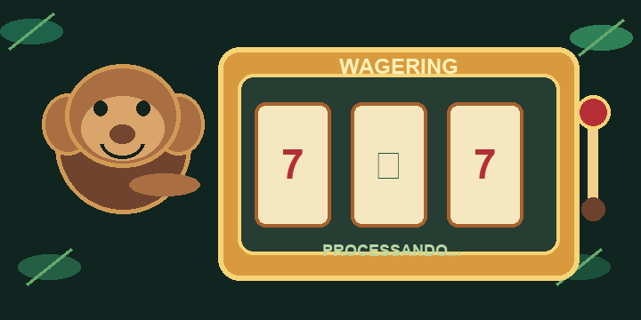

# Wagering Processor



Serviço backend para processar operações de carteira usadas em apostas. O sistema valida a operação, altera o saldo com segurança, registra a movimentação no histórico e publica um evento para outros serviços.

## Garantias principais

- O saldo não fica negativo.
- Uma operação repetida não gera um segundo débito.
- O histórico da carteira não pode ser alterado depois de gravado.
- Saldo, histórico e transação são confirmados juntos ou nenhum é confirmado.
- Falhas de mensagem podem ser repetidas e depois enviadas para uma fila de erros.
- Operações que dependem de uma referência ausente ficam pendentes e são reprocessadas.

## Executar localmente

Requisitos: Bun 1.x e Docker Desktop com Docker Compose.

```powershell
bun install
Copy-Item .env.example .env
docker compose up -d --wait
bun run db:migrate
bun run dev
```

A API fica em `http://localhost:3000`. O Docker inicia PostgreSQL e LocalStack, que simula as filas SQS.

## Comandos úteis

```powershell
bun run typecheck
bun run test
bun run test:unit
bun run test:integration
bun run db:status
bun run db:rollback
```

Os testes de integração usam PostgreSQL e LocalStack reais. Os containers precisam estar ligados.

## Endpoints principais

- `POST /wallets` cria uma carteira.
- `GET /wallets/:walletId` consulta saldo e versão.
- `GET /wallets/:walletId/ledger` consulta o histórico com paginação.
- `POST /wallets/:walletId/reconciliation` compara saldo e histórico.
- `POST /wagering/transactions` processa uma operação; `Idempotency-Key` é obrigatório.
- `GET /wagering/transactions/:transactionId` consulta uma operação.
- `GET /providers/:providerId/wagering/transactions/:externalTransactionId` consulta pela referência externa.
- `GET /health/live` e `GET /health/ready` verificam o serviço.
- `GET /metrics` mostra métricas do processo.

## Autenticação

A autenticação ficou fora do escopo do timebox. O ponto de extensão está descrito em [ARCHITECTURE.md](ARCHITECTURE.md). Em produção, a identidade do provedor deve ser validada por um Identity Provider e um guard do NestJS.
